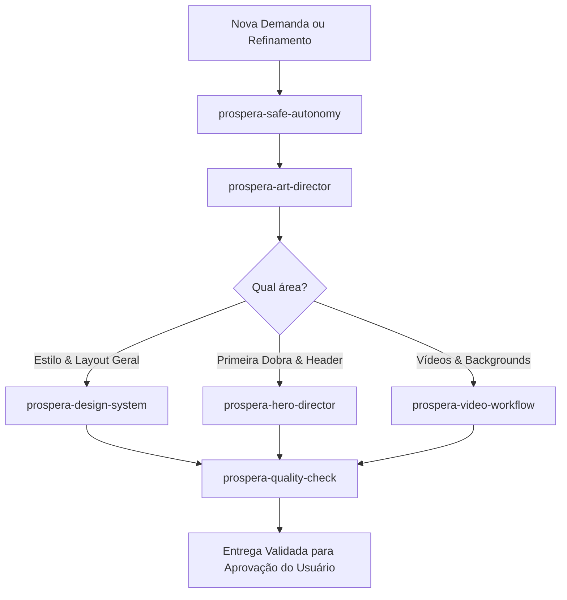

# Prospera Investment — Sistema de Skills Internas

Conjunto de Skills modulares e especializadas criadas para governar a identidade visual, direção de arte, engenharia de mídia, segurança operacional e auditoria de qualidade do projeto **Prospera Investment**.

> **Nota de Escopo:** Todas as skills deste diretório são exclusivas e restritas ao projeto `prospera-investiment`. Nenhuma regra aqui contida deve ser aplicada a outros repositórios ou pastas do sistema.

---

## 📚 Mapa das Skills Disponíveis

| Skill | Arquivo | Finalidade Principal | Quando Utilizar |
| :--- | :--- | :--- | :--- |
| **`prospera-design-system`** | [`prospera-design-system/SKILL.md`](./prospera-design-system/SKILL.md) | Identidade visual, paleta de cores (70/20/10), tipografia, espaçamento e regras de motion. | Em qualquer alteração visual, estilização CSS ou criação de novos componentes. |
| **`prospera-hero-director`** | [`prospera-hero-director/SKILL.md`](./prospera-hero-director/SKILL.md) | Composição da primeira dobra, integração de Adriana, mesa contínua, London Eye e CTAs. | Em qualquer modificação na Hero, no Header ou nos assets da primeira dobra. |
| **`prospera-video-workflow`** | [`prospera-video-workflow/SKILL.md`](./prospera-video-workflow/SKILL.md) | Pipeline de ingestão, otimização, nomenclatura padronizada e transições de vídeos. | Ao adicionar, substituir ou ajustar vídeos de Londres na Hero. |
| **`prospera-quality-check`** | [`prospera-quality-check/SKILL.md`](./prospera-quality-check/SKILL.md) | Protocolo de auditoria técnica (`build`, `tsc`) e validação visual em 8 breakpoints. | Obrigatoriamente antes de considerar qualquer tarefa finalizada. |
| **`prospera-safe-autonomy`** | [`prospera-safe-autonomy/SKILL.md`](./prospera-safe-autonomy/SKILL.md) | Limites de escopo territorial, regras estritas de Git e proteção contra ações destrutivas. | Como diretriz permanente em todas as ações autônomas do agente. |
| **`prospera-fast-execution`** | [`prospera-fast-execution/SKILL.md`](./prospera-fast-execution/SKILL.md) | Execução enxuta de tarefas pequenas/médias com mínimo atrito e sem varreduras desnecessárias. | Em ajustes rápidos de CSS, textos, componentes e refinos pontuais. |
| **`prospera-debug-recovery`** | [`prospera-debug-recovery/SKILL.md`](./prospera-debug-recovery/SKILL.md) | Recuperação resiliente após erros/quedas, preservando código e executando apenas o delta. | Ao retomar trabalho interrompido ou após erro de execução sem recomeçar do zero. |
| **`prospera-responsive-layout`** | [`prospera-responsive-layout/SKILL.md`](./prospera-responsive-layout/SKILL.md) | Harmonia visual e proporção nobre em 9 resoluções (Mobile, Tablet, Desktop, Ultrawide). | Em alterações de layout, enquadramento, quebras de tela e fluidez visual. |
| **`prospera-art-director`** | [`prospera-art-director/SKILL.md`](./prospera-art-director/SKILL.md) | Filtro criativo dos 12 questionamentos, princípio *Less But Better* e posicionamento de luxo. | Antes de propor ou aprovar decisões estéticas, enquadramentos e hierarquias. |

---

## 🧭 Como as Skills se Articulam no Fluxo do Agente

### Regras de Operação Conjunta
1. **Alterações Visuais Gerais:** Devem obrigatoriamente respeitar as diretrizes de `prospera-design-system` e passar pelo filtro de `prospera-art-director`.
2. **Refinamento da Hero:** Deve seguir à risca `prospera-hero-director`, garantindo Adriana sem moldura, mesa contínua e proteção contra a London Eye.
3. **Gestão de Vídeos:** Deve seguir `prospera-video-workflow`, evitando loops, varreduras desnecessárias e arquivos pesados.
4. **Finalização de Tarefas:** Nenhuma entrega pode ser rotulada como concluída sem a execução do checklist de `prospera-quality-check`.
5. **Governança e Segurança:** As fronteiras de `prospera-safe-autonomy` são invioláveis (sem commits/pushes automáticos, sem tocar em outros repositórios).
