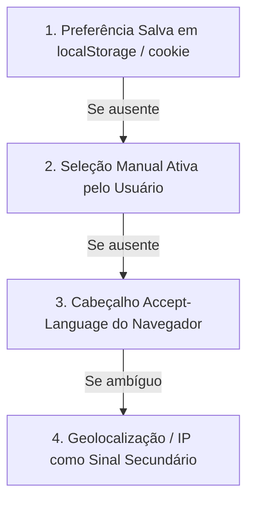

# Prospera Bilingual Architecture

Skill de planejamento e padronização arquitetural para suporte internacional bilíngue (PT-BR / EN-GB), garantindo internacionalização consistente sem quebras de layout.

---

## 1. Diretrizes Fundamentais de Internacionalização

- **Idiomas Alvo:** Português (Brasil) como idioma primário de investidores latino-americanos, e Inglês (Reino Unido) para parceiros, bancos e investidores institucionais globais.
- **Não Execução Antecipada:** Esta skill define a arquitetura e as regras de implementação. Não instale bibliotecas pesadas (i18next completo) nem crie centenas de arquivos JSON de tradução sem solicitação expressa do usuário.

---

## 2. Ordem de Resolução de Idioma (Hierarchy of Truth)

O sistema nunca deve forçar um idioma baseado apenas no endereço IP do visitante. A detecção deve seguir estritamente esta prioridade:

1. **Preferência Salva (`localStorage` / `cookie`):** Se o usuário já escolheu seu idioma anteriormente, respeite sempre a escolha gravada.
2. **Seleção Manual:** Seletor visível no Header permitindo alternância instantânea.
3. **Idioma do Navegador (`navigator.language`):** Preferência declarada no sistema do cliente.
4. **Geolocalização / IP:** Utilizado apenas como último critério de desempate.

---

## 3. Padrão Visual do Seletor no Header

- **Elementos:** Indicador textual discreto (`PT` / `EN`) acompanhado de micro-bandeiras (Brasil e Union Jack britânica) como apoio visual refinado.
- **Acessibilidade:** Botão com `aria-label="Alterar idioma para Inglês / Switch language to English"`.
- **Rotas Futuras:** Estruturação compatível com subdiretórios limpos:
  - `/` ou `/pt/`: Conteúdo em Português
  - `/en/`: Conteúdo em Inglês Britânico
