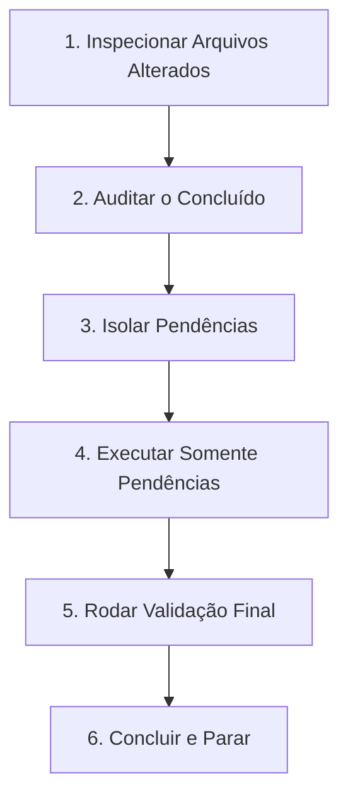

# Prospera Debug Recovery

Skill de contingência, estabilidade e resiliência projetada para garantir que falhas, interrupções ou erros de execução nunca destruam progresso prévio ou forcem o agente a recomeçar tarefas do zero.

---

## 1. Princípio Fundamental

> **"Nunca recomece do zero. Verifique o estado atual, preserve o trabalho válido e execute estritamente o que estiver faltando."**

Quando um erro ocorre ou uma sessão é interrompida, o estado do repositório contém avanços parciais válidos. Descartar esse progresso gera retrabalho, lentidão e risco de regressão. A recuperação deve ser cirúrgica, rápida e segura.

---

## 2. Regras Obrigatórias e Inegociáveis

1. **Nunca recomeçar uma tarefa inteira após erro:** Proibido reescrever componentes ou fluxos completos se apenas uma parte falhou.
2. **Nunca executar resets destrutivos:** Estritamente proibido rodar `git reset --hard`, `git restore .` ou `git clean -fd` automaticamente.
3. **Preservar alterações válidas:** Identificar o que já foi modificado com sucesso e manter intacto.
4. **Localizar o ponto exato da interrupção:** Entender em qual arquivo, linha ou comando a execução parou.
5. **Executar somente pendências (Delta Execution):** Atuar apenas nos arquivos e trechos que ainda não foram concluídos.
6. **Não repetir comandos pesados desnecessários:** Se o build ou conversão de vídeo já foi executado e não houve alteração no asset/código dependente, não execute novamente em loop.
7. **Não reprocessar mídias válidas:** Imagens WebP, vídeos MP4/WebM e posters já gerados e validados em `public/assets/prospera/` não devem ser reexportados.
8. **Não recriar arquivos já existentes:** Sempre verificar a existência antes de propor criação. Modificar pontualmente se necessário.
9. **Regra das Duas Falhas:** Se uma abordagem ou biblioteca falhar duas vezes consecutivas, abandone-a imediatamente e adote uma solução nativa ou mais simples (ex.: substituir animação complexa por CSS padrão ou transição fluida).
10. **Evitar paralisia por análise:** Proibido passar minutos executando varreduras de leitura sem produzir alterações concretas. Identifique a pendência e aja.

---

## 3. Fluxo de Recuperação Cirúrgica (6 Passos)

Em qualquer retomada após erro, execute rigorosamente a seguinte sequência:

### Passo 1: Inspecionar Arquivos Alterados
- Rodar `git status` para mapear quais arquivos estão no *working tree* (modificados, untracked ou em stage).
- Não reverter nada.

### Passo 2: Auditar o que já está Concluído
- Conferir rapidamente se as partes alteradas atendem ao escopo parcial da tarefa.
- Se um componente foi refatorado e compila, considere-o finalizado.

### Passo 3: Isolar Pendências
- Listar exatamente quais requisitos do prompt original ainda não foram atendidos.
- Isolar a causa raiz do erro anterior (ex.: erro de sintaxe, import faltante, tipo incorreto).

### Passo 4: Executar Somente as Pendências
- Fazer a edição cirúrgica exclusivamente no arquivo com pendência.
- Aplicar a abordagem mais direta e simples possível.

### Passo 5: Rodar Validação
- Rodar validação técnica pontual (`npx tsc --noEmit` ou `npm run build`).
- Resolver apenas novos erros introduzidos pela alteração pendente.

### Passo 6: Parar
- Assim que o build passar e a pendência for sanada, encerrar a execução imediatamente. Não inventar refatorações adicionais.

---

## 4. Tratamento de Falhas e Regra das Duas Falhas

| Tentativa | Ação Permitida |
| :--- | :--- |
| **Falha 1** | Diagnosticar o log exato de erro, ajustar a sintaxe ou tipagem no ponto específico e retentar. |
| **Falha 2** | **Parada obrigatória da abordagem.** Não tente uma 3ª variação da mesma técnica complexa. Substitua imediatamente por uma solução minimalista (ex.: estilo inline direto, CSS utility class, remoção de dependência conflitante). |

---

## 5. Anti-padrões Proibidos

- ❌ `git reset --hard HEAD` após um erro de compilação.
- ❌ Reinstalar a pasta `node_modules` inteira para resolver erro de TypeScript pontual.
- ❌ Regerar todos os arquivos de vídeo porque um único caminho estava incorreto.
- ❌ Reinspecionar todo o diretório do projeto quando o erro foi num único arquivo `.tsx`.
- ❌ Fazer múltiplas tentativas aleatórias sem ler a mensagem de erro.

---

## 6. Governança e Integração

- **Harmonia com `prospera-safe-autonomy`:** Respeita a proibição de comandos destrutivos e preserva commits prévios.
- **Harmonia com `prospera-fast-execution`:** Foca no menor problema pendente com velocidade máxima.
- **Harmonia com `prospera-quality-check`:** Executa a validação técnica apenas no fechamento do delta, garantindo entrega sólida.
