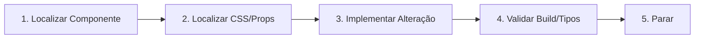

# Prospera Fast Execution

Skill de agilidade operacional focada em velocidade, foco cirúrgico e eliminação de etapas redundantes em modificações de software e design no projeto Prospera Investment.

---

## 1. Princípio Global

> **"Solve the smallest correct problem first."**  
> *(Resolva primeiro o menor problema correto com o mínimo de atrito.)*

Tarefas pequenas e médias não devem se transformar em sessões de 20 a 40 minutos com dezenas de varreduras desnecessárias. O foco deve ser direto: identificar o ponto de alteração, intervir com precisão cirúrgica, validar e parar.

---

## 2. Regras de Otimização e Velocidade

1. **Sem varredura ampla:** Não analisar o projeto inteiro para fazer uma alteração localizada em um componente ou tela.
2. **Abertura seletiva de arquivos:** Abrir e inspecionar **apenas** os arquivos diretamente relacionados à tarefa solicitada.
3. **Reutilização mandatória:**
   - Reutilizar componentes existentes (botões, cards, overlays, modais).
   - Reutilizar estilos e utilitários já presentes em Tailwind / CSS do projeto.
4. **Sem refatoração precoce:** Não reinventar arquitetura, não criar pastas desnecessárias, nem migrar tecnologias sem solicitação explícita.
5. **Soluções nativas leves:** Priorizar CSS/Tailwind e React nativo antes de cogitar scripts pesados ou pacotes externos.
6. **Escopo local estrito:** Nunca realizar pesquisas ou buscas globais no computador fora do escopo estrito da pasta do projeto.
7. **Sem reprocessamento desnecessário de mídia:** Nunca recodificar, redimensionar ou mover arquivos de vídeo/imagem se os existentes atendem ao requisito.
8. **Edição contínua, validação única:** Não rodar múltiplos builds no meio do raciocínio ou a cada linha editada. Edite primeiro, valide no final.
9. **Parada imediata:** Assim que o objetivo estipulado no prompt estiver cumprido, pare imediatamente.

---

## 3. Fluxo Expresso para Tarefas Visuais (5 Etapas)

Para demandas de layout, tipografia, cores, botões ou componentes visuais:

1. **Localizar Componente:** Identificar o arquivo alvo direto (ex.: `HeroSection.tsx`, `Header.tsx`, `InvestModal.tsx`).
2. **Localizar CSS Necessário:** Mapear a classe Tailwind ou propriedade de estilo requerida.
3. **Implementar:** Executar a edição precisa no bloco de código em questão.
4. **Validar:** Rodar a validação de compilação apenas uma vez (`npm run build` ou `npx tsc --noEmit`).
5. **Parar:** Finalizar sem expandir escopo.

---

## 4. Tabela de Decisão Rápida: O que Fazer vs. O que Evitar

| Demanda Típica | Caminho Rápido (Correto) | Caminho Desperdiçador (Evitar) |
| :--- | :--- | :--- |
| **Ajustar cor ou espaçamento** | Localizar a classe Tailwind no componente e alterar o token diretamente. | Ler 10 arquivos de estilo, reconfigurar `tailwind.config.js` ou rodar build intermediário. |
| **Ajustar headline ou CTA** | Editar a string e as classes no componente da seção alvo. | Fazer varredura no repositório inteiro buscando todas as ocorrências de texto. |
| **Ajustar vídeo de fundo** | Atualizar caminho do asset ou classe de enquadramento (`object-cover`). | Reconverter vídeos existentes com ffmpeg ou recriar posters WebP válidos. |
| **Resolver erro de digitação/tipo** | Corrigir a interface ou tipagem no arquivo que acusou o erro. | Executar varreduras repetidas em pastas intactas. |

---

## 5. Meta de Produtividade

- **Tempo-alvo para microajustes (cores, textos, paddings):** Menos de 2 minutos.
- **Tempo-alvo para componentes médios (cards, modais, seções):** Menos de 5 minutos.
- **Eliminação de overhead:** Zero iterações de auditoria profunda quando o escopo é pontual.

---

## 6. Governança e Integração

- **Harmonia com `prospera-safe-autonomy`:** Respeita o escopo restrito sem invadir outros diretórios ou criar commits sem permissão.
- **Harmonia with `prospera-debug-recovery`:** Conecta-se diretamente em caso de falha, resolvendo o delta sem reiniciar do zero.
- **Harmonia with `prospera-design-system`:** Usa as variáveis e tokens já definidos, acelerando a estilização.
