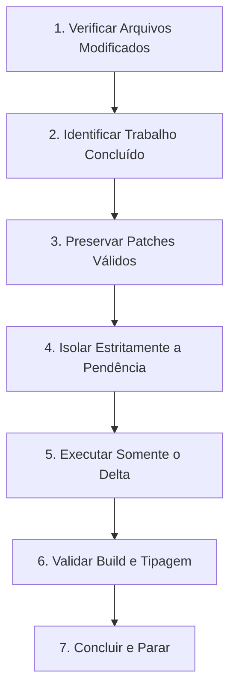

# Prospera Task Resume

Skill operacional obrigatória para recuperação de tarefas interrompidas por queda, timeout ou encerramento inesperado de sessão no projeto Prospera Investment.

---

## 1. Princípio de Ação

> **"RESUME, DON'T RESTART."**  
> *(Retome, nunca recomece do zero.)*

Quando a sessão do agente for interrompida por erro, queda de conexão, timeout ou fechamento abrupto, o repositório mantém arquivos e avanços parciais válidos. A postura padrão deve ser sempre de preservação e continuidade cirúrgica.

---

## 2. Protocolo de Retomada Obrigatório

Ao iniciar ou retomar uma tarefa após interrupção, siga rigorosamente esta sequência de 7 passos:

1. **Verificar arquivos atualmente modificados:** Checar o estado do Git e dos arquivos locais.
2. **Identificar trabalho já concluído:** Mapear o que já foi codificado, criado ou refinado com sucesso.
3. **Preservar patches válidos:** Manter o código correto sem descartar ou reescrever arquivos completos.
4. **Isolar estritamente a pendência:** Descobrir qual era o próximo passo planejado ou não finalizado.
5. **Executar somente o delta:** Focar exclusivamente no trecho ou arquivo faltante.
6. **Validar:** Rodar compilação (`npm run build`) e checagem de tipos (`npx tsc --noEmit`).
7. **Concluir e parar:** Não iniciar tarefas não solicitadas nem reescrever seções já estáveis.

---

## 3. Diretrizes de Proteção

- **Nunca executar reset destrutivo:** Proibido rodar comandos como `git reset --hard`, `git clean -fd` ou `git restore .`.
- **Não reanalisar o projeto inteiro:** Não faça varreduras completas no repositório; foque estritamente no arquivo ou componente alvo da solicitação.
- **Não reprocessar mídias válidas:** Imagens e vídeos já otimizados ou validados em `public/assets/prospera/` devem ser preservados sem regerar.
- **Regra das Duas Falhas:** Se uma abordagem falhar duas vezes consecutivas:
  - Reduza a tarefa;
  - Divida em etapas menores;
  - Execute a menor etapa correta primeiro.
