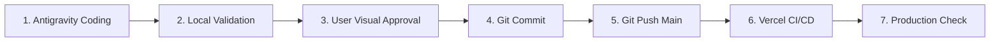

# Prospera Vercel Workflow

Skill de governança de release que estabelece a cadência previsível de desenvolvimento, aprovação e deploy da Prospera Investment na infraestrutura da Vercel.

---

## 1. O Ciclo de Release Previsível (7 Estágios)

1. **Antigravity Coding:** Desenvolvimento ou refinamento de código com escopo restrito e cirúrgico.
2. **Local Validation:** Execução local de `npm run build` e `npx tsc --noEmit`.
3. **User Visual Approval:** O usuário inspeciona o resultado no navegador ou preview antes de aprovar a gravação permanente no Git.
4. **Git Commit:** Criação de commit semântico com mensagem clara sobre a entrega.
5. **Git Push Main:** Envio das alterações para a branch `main` no GitHub.
6. **Vercel CI/CD:** A Vercel detecta o push e dispara o build automático de produção.
7. **Production Check:** Validação rápida de links, vídeos e assets no domínio de produção.

---

## 2. Diagnóstico de Divergências (Local vs. Vercel)

Se o projeto compilar localmente no Windows mas falhar na Vercel (ambiente Linux):
- **Case-Sensitivity de Arquivos:** No Windows, `Header.tsx` e `header.tsx` são tratados como iguais. No Linux da Vercel, causam erro de compilação imediato. Sempre certifique-se de que a caixa dos caracteres de importação bate exatamente com o arquivo no disco.
- **Roteamento SPA:** Garantir que o `vercel.json` contenha as regras de rewrite para Single Page Applications caso sejam criadas rotas no cliente.
- **Assets Ausentes no Git:** Verificar se novos arquivos em `public/` foram adicionados pelo Git e não ignorados por regras acidentais no `.gitignore`.
