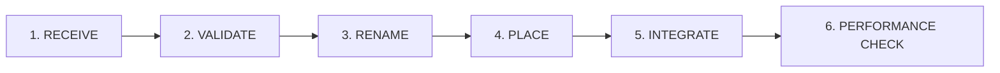

# Prospera Video Asset Pipeline

Skill de gestão de mídia responsável por garantir a padronização, organização e rastreabilidade de todo arquivo audiovisual introduzido na base de código da Prospera Investment.

---

## 1. Estrutura Canônica de Diretórios

Todos os vídeos e imagens de mídia do projeto devem habitar estritamente as pastas abaixo:

```text
public/assets/prospera/
├── video/                      # Vídeos gerais de fundo (Hero e Seção Adriana)
│   ├── adriana-about-bg.mp4    # Vídeo de fundo da segunda dobra (#sobre)
│   ├── london-big-ben.mp4      # Playlist Hero Cena 1
│   ├── london-thames-bridge.mp4# Playlist Hero Cena 2
│   ├── london-eye.mp4          # Playlist Hero Cena 3
│   ├── london-streets.mp4      # Playlist Hero Cena 4
│   ├── london-skyline.mp4      # Playlist Hero Cena 5
│   └── london-victoria-memorial.mp4 # Playlist Hero Cena 6
└── routes/                     # Mídias e vídeos curtos das Rotas de Investimento
    ├── buy-to-let.mp4          # Card 1: Buy-to-Let
    ├── hmo.mp4                 # Card 2: HMO
    ├── flip.mp4                # Card 3: Flip / Reforma
    ├── portfolio-building.mp4  # Card 4: Portfolio Building
    ├── capital-appreciation.mp4# Card 5: Valorização Patrimonial
    └── new-developments.mp4    # Card 6: New Developments
```

---

## 2. O Ciclo de Ingestão em 6 Etapas

Ao receber um novo vídeo do usuário ou de um pipeline generativo:



1. **RECEIVE:** Identificar o arquivo na pasta de download ou staging temporário.
2. **VALIDATE:** Checar extensão (`.mp4` ou `.webm`), resolução (preferencialmente 1080p ou 720p), ausência de trilhas sonoras desnecessárias e integridade de codec (H.264/AAC).
3. **RENAME:** Renomear para o padrão kebab-case oficial sem caracteres especiais ou espaços.
4. **PLACE:** Mover o arquivo para o caminho relativo correto em `public/assets/prospera/...`.
5. **INTEGRATE:** Configurar o elemento `<video>` com atributos `autoPlay`, `muted`, `loop`, `playsInline`, `preload="metadata"` e `poster`.
6. **PERFORMANCE CHECK:** Executar `npm run build` e validar tempo de carregamento e estabilidade do layout.

---

## 3. Regra de Não Sobrescrita

> **"Nunca sobrescreva um asset aprovado sem autorização explícita do usuário."**

Se um novo vídeo for recebido para substituir um existente, preserve o arquivo anterior com sufixo ou solicite confirmação antes de descartar a mídia validada.
